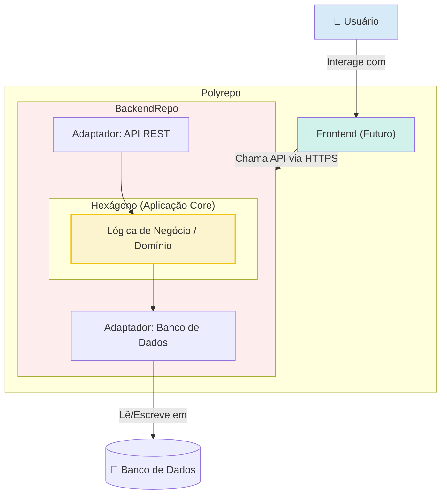

# **Documento de Arquitetura: Sistema de Controle de Contas Pessoal**

## **1. Arquitetura de Alto Nível**

### **Resumo Técnico**

A arquitetura para o Sistema de Controle de Contas Pessoal será um **Monolito** coeso, desenvolvido em um **Polyrepo** para separar claramente o backend do futuro frontend. O design do backend seguirá estritamente o padrão de **Arquitetura Hexagonal (Ports and Adapters)**, garantindo que a lógica de negócio principal seja isolada e independente de tecnologias externas como o banco de dados e o framework da API. Esta abordagem, combinada com os princípios SOLID e Clean Code, resultará em um sistema manutenível, testável e preparado para futuras evoluções.

### **Diagrama de Alto Nível do Projeto**



## **2. Tech Stack**

| Categoria | Tecnologia | Versão Sugerida | Propósito | Racional |
| :--- | :--- | :--- | :--- | :--- |
| **Linguagem** | Python | 3.12.9+ | Linguagem principal | Sua escolha. Uma linguagem moderna e versátil com um ecossistema robusto para desenvolvimento web. |
| **Ambiente Virtual/Instalador**| UV | \~0.1.x | Gerenciamento de dependências e ambiente virtual | Sua escolha. Uma ferramenta extremamente rápida e moderna que acelera o fluxo de trabalho de desenvolvimento. |
| **Framework Backend** | FastAPI | \~0.111.x | Estrutura principal da aplicação API | Sua escolha. Framework de alta performance que utiliza type hints para validação e documentação automáticas. |
| **Servidor ASGI** | Uvicorn | \~0.29.x | Servidor para aplicações assíncronas | Servidor padrão para FastAPI, garantindo a execução assíncrona da aplicação. |
| **Banco de Dados** | MongoDB | 7.x+ | Armazenamento persistente dos dados | Sua escolha. Banco de dados NoSQL orientado a documentos, oferecendo flexibilidade e escalabilidade. |
| **Driver do Banco de Dados**| Motor | \~3.4.x | Driver assíncrono para MongoDB | Sua escolha. Permite a comunicação não-bloqueante com o MongoDB, alinhado à natureza assíncrona do FastAPI. |
| **Validação de Dados** | Pydantic | \~2.7.x | Validação de schemas e tipos de dados | Padrão do FastAPI. Usado para definir os modelos de dados da API. |
| **Testes** | Pytest | \~8.2.x | Framework para testes unitários | Framework de testes mais popular para Python, conhecido por sua simplicidade e poder. |
| **Autenticação** | JWT (python-jose) | - | Gerenciamento de sessões de usuário via tokens | Padrão de mercado para APIs stateless. |
| **Containerização de Dependências**| Docker | - | Gerenciar serviços de dependência (ex: MongoDB) no ambiente de desenvolvimento. | Sua escolha. Simplifica o setup local, garantindo consistência entre os ambientes de desenvolvimento. |

## **3. Modelos de Dados (Pydantic)**

```python
import uuid
from typing import Optional
from datetime import date, datetime
from pydantic import BaseModel, EmailStr, Field

class User(BaseModel):
    id: uuid.UUID = Field(default_factory=uuid.uuid4, alias="_id")
    email: EmailStr
    hashed_password: str = Field(..., alias="password")
    currency: str = Field(default="BRL", alias="preferences.currency")
    timezone: str = Field(default="America/Sao_Paulo", alias="preferences.timezone")

class Account(BaseModel):
    id: uuid.UUID = Field(default_factory=uuid.uuid4, alias="_id")
    user_id: uuid.UUID
    name: str
    type: str  # ex: "checking", "savings", "credit_card"
    balance: float
    is_primary: bool = False

class Category(BaseModel):
    id: uuid.UUID = Field(default_factory=uuid.uuid4, alias="_id")
    user_id: Optional[uuid.UUID] = None # Nulo para categorias padrão
    name: str
    type: str # "expense" ou "income"
    is_system: bool = False

class Transaction(BaseModel):
    id: uuid.UUID = Field(default_factory=uuid.uuid4, alias="_id")
    user_id: uuid.UUID
    account_id: uuid.UUID
    category_id: uuid.UUID
    amount: float # Negativo para despesas, positivo para receitas
    description: str
    date: datetime
    type: str # "expense" ou "income"

class RecurringTransaction(BaseModel):
    id: uuid.UUID = Field(default_factory=uuid.uuid4, alias="_id")
    account_id: uuid.UUID
    category_id: uuid.UUID
    description: str
    amount: float
    type: str # "expense" ou "income"
    frequency: str # Ex: "Mensal", "Semanal", "Anual"
    start_date: date
    end_date: Optional[date] = None
    next_due_date: date
```

## **4. Esquema do Banco de Dados (MongoDB)**

O esquema será definido e validado pela aplicação através dos modelos Pydantic acima. Para garantir a performance, os seguintes índices serão criados:

* **Users:** Índice único no campo `email`.
* **Accounts:** Índice no campo `user_id`.
* **Categories:** Índice no campo `user_id`.
* **Transactions:** Índices compostos em (`user_id`, `date`) e (`account_id`, `date`).
* **RecurringTransactions:** Índice em `next_due_date`.

## **5. Estrutura de Pastas (Source Tree)**

A estrutura de pastas do projeto seguirá o padrão de Arquitetura Hexagonal:

```plaintext
/controle-contas-api/
|
|--.venv/
|
|--/app/
|  |--/core/
|  |  |--/domain/
|  |  |--/services/
|  |  |--/ports/
|  |     |--/database.py
|  |     |--/auth.py
|  |
|  |--/adapters/
|  |  |--/api/
|  |  |  |--/v1/
|  |  |  |  |--/routes/
|  |  |  |  |--/schemas.py
|  |  |
|  |  |--/database/
|  |  |  |--/mongodb/
|  |  |     |--/repositories/
|  |  |
|  |  |--/auth/
|  |
|  |--/config/
|  |  |--/settings.py
|  |
|  |--main.py
|
|--/tests/
|  |--/core/
|  |--/adapters/
|
|--.gitignore
|--pyproject.toml
|--README.md
```