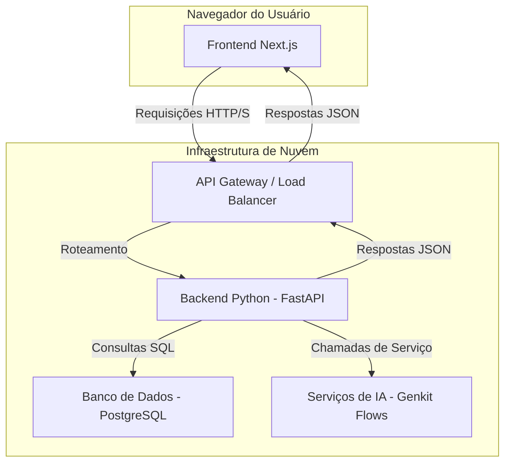

# Documento de Arquitetura - Backend Controle Fácil (Python)

## 1. Visão Geral

Este documento descreve a arquitetura de alto nível para o sistema de backend da aplicação **Controle Fácil**. O backend será desenvolvido em Python e servirá como a camada de serviço para o frontend existente em Next.js.

O objetivo é projetar um sistema robusto, escalável e seguro que implemente a lógica de negócios e os modelos de dados definidos no [Documento de Requisitos do Produto (PRD)](./prd.md).

## 2. Arquitetura de Alto Nível

A arquitetura seguirá um modelo de **serviços desacoplados**, onde o frontend (Next.js) é o consumidor primário dos serviços expostos pelo backend (Python) através de uma **API RESTful**.



**Componentes:**

* **Frontend (Next.js):** A aplicação cliente que renderiza a interface do usuário e consome os dados da API.
* **API Gateway:** Ponto de entrada para todas as requisições, responsável por roteamento, rate limiting e, potencialmente, autenticação inicial.
* **Backend Python (FastAPI):** O núcleo do sistema, responsável por:
  * Expor os endpoints da API RESTful.
  * Implementar a lógica de negócios.
  * Validar dados de entrada e saída.
  * Orquestrar a comunicação com o banco de dados e os serviços de IA.
* **Banco de Dados (PostgreSQL):** Sistema de gerenciamento de banco de dados relacional para persistir todos os dados da aplicação (usuários, contas, transações, etc.).
* **Serviços de IA (Genkit Flows):** Os fluxos de Genkit (Node.js) existentes serão tratados como microserviços externos. O backend Python atuará como um proxy, chamando esses serviços quando necessário.

## 3. Pilha de Tecnologia (Backend)

| Componente              | Tecnologia Recomendada                                     | Justificativa                                                                                                                             |
| ----------------------- | ---------------------------------------------------------- | ----------------------------------------------------------------------------------------------------------------------------------------- |
| **Framework Web**       | [**FastAPI**](https://fastapi.tiangolo.com/)               | Moderno, de alta performance, com validação de dados nativa (usando Pydantic) e geração automática de documentação da API (Swagger/OpenAPI). |
| **ORM**                 | [**SQLAlchemy 2.0**](https://www.sqlalchemy.org/) (Async)  | O ORM mais robusto e maduro para Python, com suporte a operações assíncronas que se integram perfeitamente com o FastAPI.                  |
| **Banco de Dados**      | [**PostgreSQL**](https://www.postgresql.org/)              | Banco de dados relacional poderoso, confiável e com um rico conjunto de funcionalidades, ideal para aplicações financeiras.             |
| **Validação de Dados**  | [**Pydantic V2**](https://docs.pydantic.dev/latest/)       | Utilizado nativamente pelo FastAPI, garante a integridade dos dados na camada da API, servindo como a definição dos schemas da aplicação.   |
| **Autenticação**        | **JWT (JSON Web Tokens)**                                  | Padrão para APIs stateless. A biblioteca `python-jose` pode ser usada para criar e validar os tokens.                                     |
| **Gerenciamento de Senhas** | `passlib` com `bcrypt`                                       | Biblioteca padrão para hashing seguro de senhas.                                                                                         |
| **Containerização**     | [**Docker**](https://www.docker.com/)                      | Para criar ambientes de desenvolvimento e produção consistentes e portáveis.                                                              |
| **Deployment**          | **Google Cloud Run** / **Firebase App Hosting (backend)** | Plataformas serverless que permitem escalar automaticamente com a demanda, incluindo instâncias com "scale-to-zero" para otimizar custos.   |

## 4. Estrutura do Projeto (Sugestão)

A estrutura de diretórios pode ser organizada da seguinte forma para promover a modularidade e a separação de preocupações:

```
controlefacil_backend/
├── app/
│   ├── __init__.py
│   ├── main.py                 # Ponto de entrada do FastAPI, configuração da aplicação
│   ├── core/
│   │   ├── __init__.py
│   │   ├── config.py           # Configurações (variáveis de ambiente, etc.)
│   │   └── security.py         # Funções de hashing, criação e validação de JWT
│   ├── db/
│   │   ├── __init__.py
│   │   ├── base.py             # Base declarativa do SQLAlchemy e engine de conexão
│   │   └── session.py          # Gerenciamento de sessões do banco de dados
│   ├── models/                 # Modelos do SQLAlchemy (ex: user.py, account.py)
│   │   ├── __init__.py
│   │   ├── account.py
│   │   ├── transaction.py
│   │   └── user.py
│   ├── schemas/                # Schemas do Pydantic (ex: user.py, transaction.py)
│   │   ├── __init__.py
│   │   ├── account.py
│   │   ├── msg.py              # Schemas para mensagens genéricas de resposta
│   │   ├── token.py            # Schema para o token JWT
│   │   ├── transaction.py
│   │   └── user.py
│   ├── services/               # Lógica de negócio (ex: user_service.py)
│   │   ├── __init__.py
│   │   ├── account_service.py
│   │   └── ai_service.py       # Serviço para interagir com os Genkit Flows
│   └── api/
│       ├── __init__.py
│       ├── deps.py             # Dependências do FastAPI (ex: obter usuário atual)
│       └── routes/             # Endpoints da API (ex: auth.py, accounts.py)
│           ├── __init__.py
│           ├── accounts.py
│           ├── auth.py
│           └── transactions.py
├── tests/                      # Testes unitários e de integração
├── .env.example                # Arquivo de exemplo para variáveis de ambiente
├── Dockerfile                  # Definição do container Docker
├── requirements.txt            # Dependências Python
└── README.md
```

## 5. Fluxos de Dados e Lógica

### 5.1. Autenticação

1. **Registro (`/api/auth/register`):**
    * O endpoint recebe dados do usuário (nome, email, senha).
    * A senha é processada com `bcrypt` pela função em `core/security.py`.
    * Um novo objeto `User` é criado e salvo no banco de dados.
    * Um token JWT é gerado e retornado ao usuário.
2. **Login (`/api/auth/login`):**
    * O endpoint recebe email e senha.
    * O usuário é buscado no banco pelo email.
    * A senha fornecida é comparada com o hash armazenado.
    * Se as credenciais forem válidas, um novo token JWT é gerado e retornado.
3. **Requisições Autenticadas:**
    * O frontend envia o token JWT no cabeçalho `Authorization: Bearer <token>`.
    * Uma dependência do FastAPI (`deps.py`) decodifica e valida o token.
    * Se o token for válido, a identidade do usuário é extraída e disponibilizada para o endpoint.

### 5.2. Gerenciamento de Transações (Exemplo de Lógica de Negócio)

1. **Criação (`POST /api/transactions`):**
    * O endpoint recebe os dados da transação.
    * Uma sessão de banco de dados é iniciada.
    * A transação é criada e associada ao `userId` (obtido do token JWT) e `accountId`.
    * O `currentBalance` da `Account` correspondente é atualizado. Se for uma despesa, o valor é subtraído; se for uma receita, é somado.
    * A sessão é "commitada", garantindo que ambas as operações (criação da transação e atualização do saldo) ocorram de forma atômica.

### 5.3. Integração com Serviços de IA (Genkit)

O `services/ai_service.py` atuará como um cliente HTTP para os Genkit Flows.

1. **Requisição do Frontend:** O frontend envia uma requisição para o backend Python (ex: `POST /api/ai/categorize-transaction`).
2. **Proxy do Backend:**
    * O endpoint no backend Python valida a requisição.
    * O `ai_service.py` monta e envia uma requisição HTTP para o endpoint correspondente do serviço Genkit (cuja URL será configurada via variáveis de ambiente).
    * O `ai_service` aguarda a resposta do Genkit.
3. **Resposta ao Frontend:** O backend Python recebe a resposta do Genkit e a repassa para o frontend.

Essa abordagem mantém o backend Python como o único ponto de contato para o frontend, simplificando a arquitetura do cliente e centralizando a lógica e o controle de acesso.
